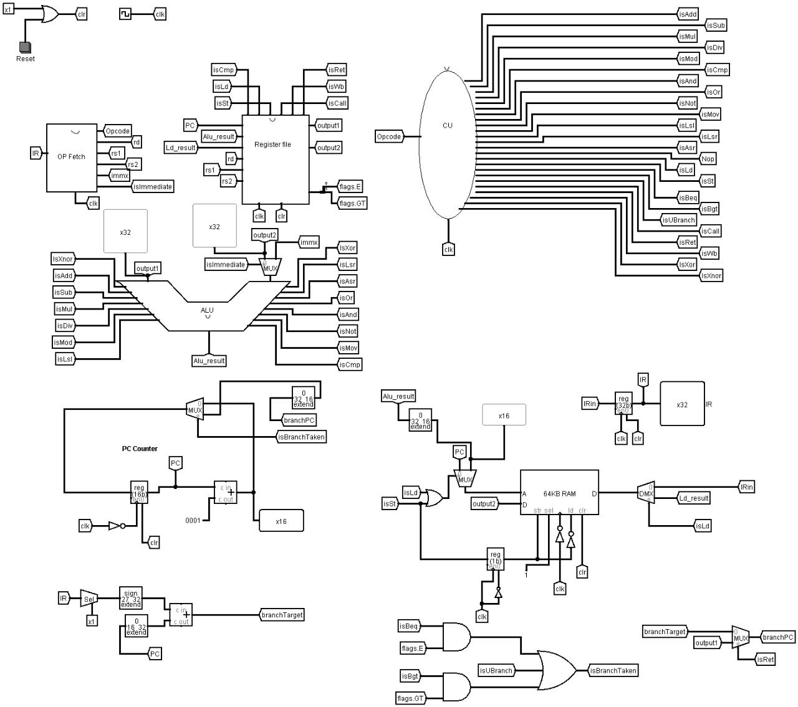

# Design and Implementation of 32bit SIMPLERISC PROCESSOR using  [Logism](http://www.cburch.com/logisim/) 

## Documentaion
- [CPU Documentation](cpudoc.md)
- [Assembler Documentation](assemblerdoc.md)
- [Example Assembly Program](example.asm)
