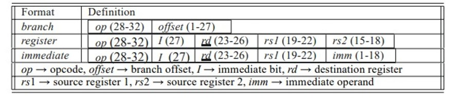
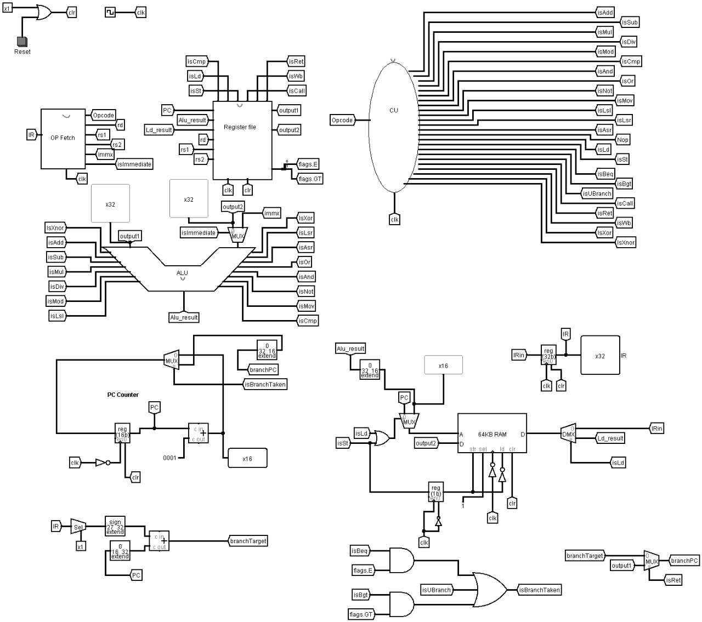
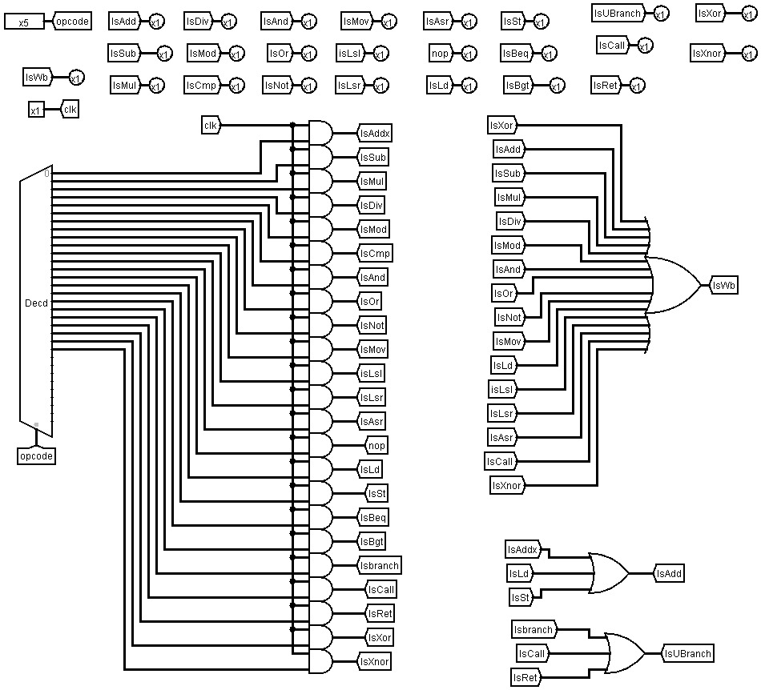
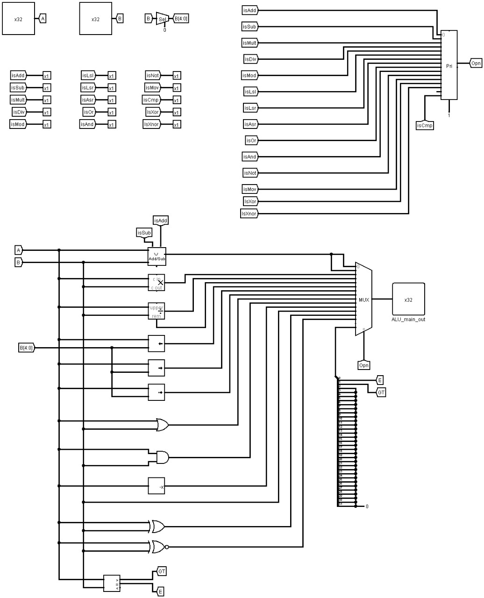
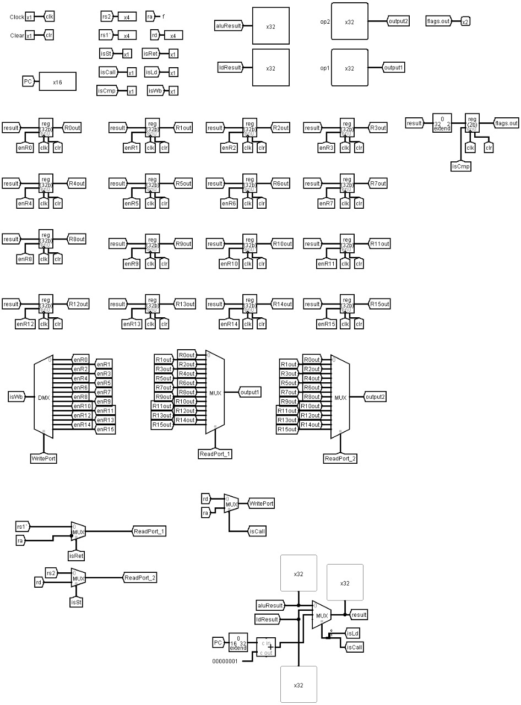

# 32-Bit SIMPLERISC Processor and Assembler - A Simulation using Logism

## Features
- Dual Port Register File with 16 General Purpose Registers of 32-Bit word length.
- 256KB RAM with a 16-Bit address bus and 32-Bit word size
- Assembler Program written in Java to convert low level assembly language to machine specific instructions.
- Arithmetic, Boolean and Conditional Jump Instructions
- Hardwired Control Unit

## Stages of Processsor
1. Instruction Fetch
2. Operand Fetch
3. Execute
4. Memory Access
5. Register Write
## Instruction Set
### Instruction Format

### Register Instructions
 OpCode | Immediate Bit | Operation | RTN  
---  | :---:|:---:|:---:
00000 | 0 | Add       		| ```RC <-- [RA]+[RB]               ``` |
00001 | 0 | Subtract         | ```RC <-- [RA]-[RB]               ``` |
00010 | 0 | Multiplication         | ```RC <-- [RA]*[RB]               ``` |
00011 | 0 | Division 			| ```RC <-- [RA]/[RB]                 ``` |
00100 | 0 | Mod 			| ```RC <-- [RA]%[RB]                 ``` |
00101 | 0 | Compare        	| ```flags.GT <-- [RA]>[RB], flags.E<--[RA]==[RB]```|
00110 | 0 | And       		| ```RC <-- [RA] AND [RB]           ``` |
00111 | 0 | OR       		| ```RC <-- [RA] OR [RB]            ``` |
01000 | 0 | NOT       		| ```RC <-- NOT [RA]                ``` |
01001 | 0 | Move 			| ```RC <-- RA                      ``` |
01010 | 0 | Logical Shift Left       		| ```RC <-- [RA]<<[RB]               ``` |
01011 | 0 | Logical Shift Right       		| ```RC <-- [RA]>>>[RB]               ``` |
01100 | 0 | Arthimetic Shift Right      		| ```RC <-- [RA]>>[RB]               ``` |
01101 | 0 | No Op    		| ```                               ``` |
10100 | 0 | Ret    		| ```                               ``` |
10101 | 0 | Xor      		| ```RC <-- [RA] XOR [RB]            ``` |
10110 | 0 | Xnor      		| ```RC <-- [RA] XNOR [RB]            ``` |
### Immediate Instructions
 OpCode | ImmediateBit | Operation | RTN  
---  | :---:|:---:|:---:
00000 | 1 | Add       		| ```RC <-- [RA]+I               ``` |
00001 | 1 | Subtract         | ```RC <-- [RA]-I              ``` |
00010 | 1 | Multiplication         | ```RC <-- [RA]*I               ``` |
00011 | 1 | Division 			| ```RC <-- [RA]/I                 ``` |
00100 | 1 | Mod 			| ```RC <-- [RA]%I                 ``` |
00101 | 1 | Compare        	| ```flags.GT <-- [RA]>I, flags.E<--[RA]==I```|
00110 | 1 | And       		| ```RC <-- [RA] AND I           ``` |
00111 | 1 | OR       		| ```RC <-- [RA] OR I            ``` |
01000 | 1 | NOT       		| ```RC <-- NOT I                ``` |
01001 | 1 | Move 			| ```RC <-- I                      ``` |
01010 | 1 | Logical Shift Left       		| ```RC <-- [RA]<<I              ``` |
01011 | 1 | Logical Shift Right       		| ```RC <-- [RA]>>>I               ``` |
01100 | 1 | Arthimetic Shift Right      		| ```RC <-- [RA]>>I               ``` |
01110 | 1 | Load 			| ```RC <-- [I+[RB]]                  ``` |
01111 | 1 | Store            | ```[I+[RA]] <-- [RB]                  ``` |
### Branch Instructions
 OpCode | Operation | RTN  
---  | :---:|:---:
10000 | Branch If equal     | ```PC <-- [PC]+offset if flags.E=1             ``` |
10001 | Branch If greater     | ```PC <-- [PC]+offset if flags.GT=1             ``` |
10010 | Branch      | ```PC <-- [PC]+offset           ``` |
10011 | Call a function      | ```PC <-- [PC]+offset           ``` |


## Components
### Main Circuit


-------

### Control Unit


------

### Arithmetic Logic Unit


------

### Register File
	

------

## Assembler
- A Java based assembler script is included with the processor. The assembler converts low level assembly language into machine instructions of hexadecimal instructions and outputs a Logism memory image. Load this memory image into the simulator to run the program. See assembler documentation file for more details.
